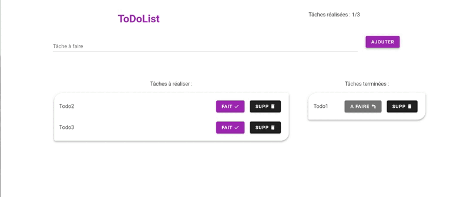

# Todo List

## Project infos
This is a simple todo list made with : 

- [Vue.js](https://vuejs.org/) 2, 
- the Vue UI Library [Vuetify](https://vuetifyjs.com/en/) 
- and the [Vuex](https://vuex.vuejs.org/) state management.

## What you can do with this project

- Add a todo to your todo list; 
- Remove a chosen todo from your todo list;
- Change the status of a chosen todo to "done" when it is inside the "todo list";
- When the todo's status is set to "done", it go from the "todo list" to the "done todo list".
- There, your can change the status of a chosen todo to "to do". (It will transfert the todo back to the original todo list);
- Remove a chosen todo from your done todo list;
- In its header, the app gives you dynamically the number of remaining todos that you have;

## Validation

Validation rules has been set up to prevent errors when adding a todo.

- The todo is required -> you can't sumbit your form if the todo input is empty;
- The todo must have at least 3 characters to be submitted;
- The todo can not be longer than 30 characters to be submitted;
